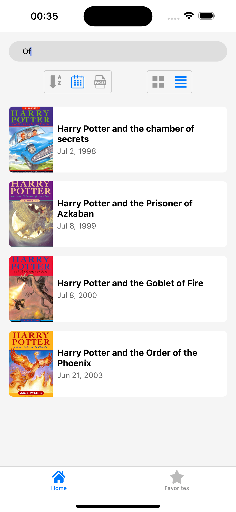
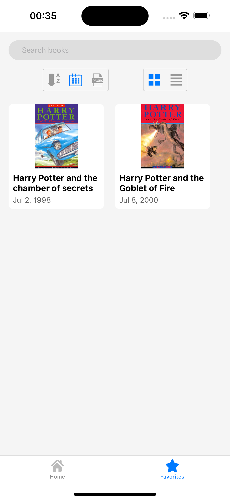
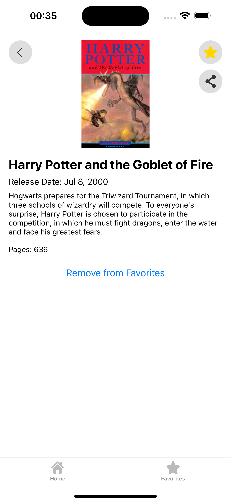
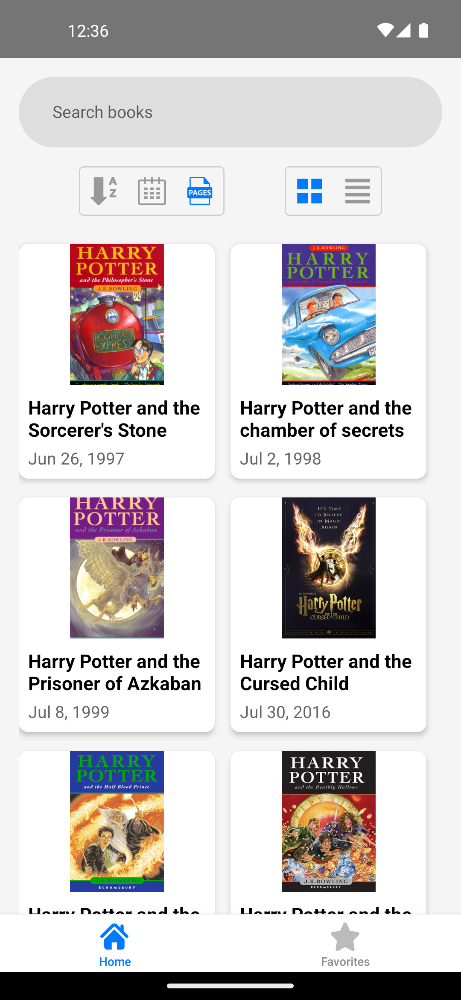
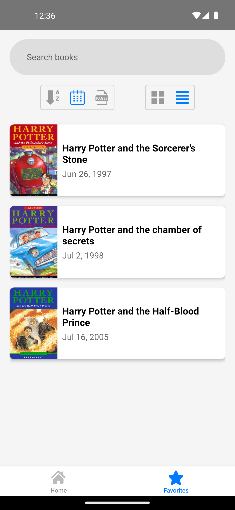
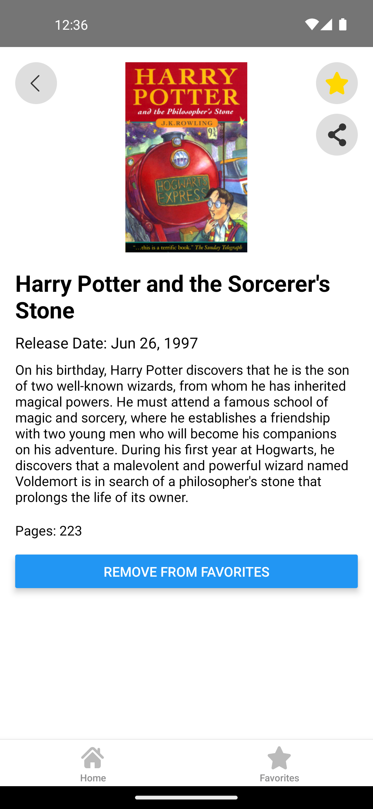

## הודעה חשובה

עבדתי על המשימה במשך שניים וחצי ימים. לא השתמשתי בחצי היום האחרון מכיוון שהוא נופל על יום שישי וזה יום ההולדת שלי. עם זאת, השלמתי את כל הדרישות שהוגדרו במשימה וגם ביצעתי כמה מהמשימות שהוגדרו כבונוס.

עם זאת, לא עבדתי על דארק מוד, תמיכה רב-לשונית וספלאש, אך מדובר בדברים שכבר הייתה לי הזדמנות לעבוד עליהם ואני שולט בהם היטב.

- לגבי דארק מוד: הייתי יוצר `state` גלובלי ב-`Redux` ושולט `styles` של הקומפוננטות באפליקציה בהתאם ל-state זה.
- לגבי תמיכה רב-לשונית: לאחר קונפיגורציה בסיסית, הייתי יוצר `state` גלובלי ב-`Redux` ושולף תרגומים מקובץ `JSON` שהיה פורמט כמו זה:
```json
{
  "en": {
    "key1": "word1",
    "key2": "word2"
  },
  "il": {
    "key1": "מלה1",
    "key2": "מלה2"
  }
}
```
- לגבי ספלאש: הייתי משתמש בספרייה `react-native-splash-screen` ומבצע קונפיגורציה בצד הנייטיב של האפליקציה.

## How to run the project

1. Clone the project
```bash
git clone https://github.com/benisda/IsracardDemoBen.git
```
2. Install dependencies
```bash
cd IsracardDemoBen
npm install
```
if you are using a Mac, you should also install the pods:
```bash
cd ios && pod install && cd ..
```

3. Run the project

for iOS:
```bash
npx react-native run-ios
```

for Android:
```bash
npx react-native run-android
```

## Screenshots

### iOS
  

### Android
  